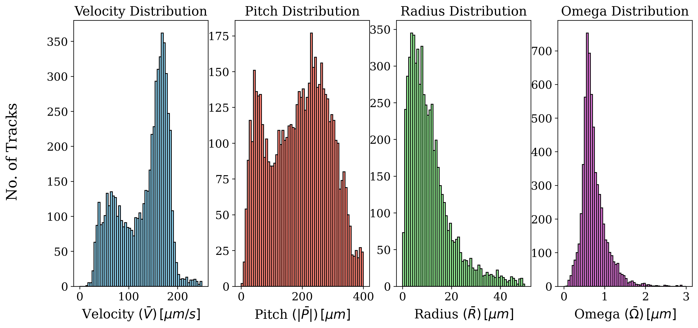
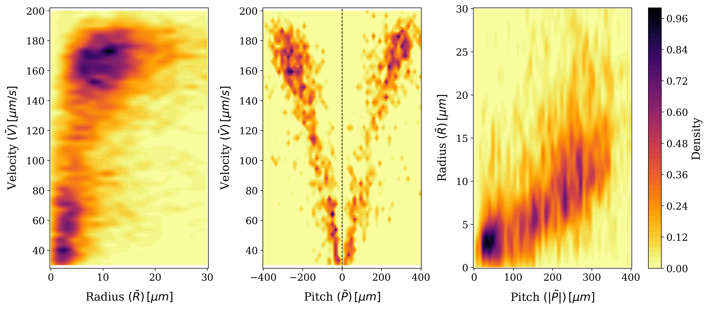

# Data Analysis of Trajectory Data

This repository contains scripts for the analysis of trajectory data. It provides functionalities to download, clean, fit curves, and analyze trajectory data, and generate various plots for visualization.

## Repository Structure

The repository has the following structure:

- `README.md`: This file, providing an overview of the repository.
- `curve_fitting/`: Directory containing the curve fitting module.
    - `__init__.py`: Initialization file for the curve fitting module.
    - `construct_eq_mat.py`: Module for constructing the equation matrix.
    - `frenet_serret.py`: Module for Frenet-Serret calculations.
    - `gen_fit.py`: Module for curve fitting using Legendre polynomials.
    - `hessian_mat_obj.py`: Module for Hessian matrix calculations.
    - `main.py`: Main script for curve fitting.
    - `orth_order_diff_mat.py`: Module for orthogonal order difference matrix calculations.
- `data/`: Directory containing the trajectory data files.
    - `cleaned_particle_data.h5`: Cleaned particle data in HDF5 format.
    - `fitted_particle_data.h5`: Fitted particle data in HDF5 format.
    - `particle_data.h5`: Raw particle data in HDF5 format.

    The `particle_data.h5` file contains trajectory data in a 5xN matrix format, where:
    - The first row represents the track number.
    - The second row represents the frame number.
    - The third row contains the X-axis positions.
    - The fourth row contains the Y-axis positions.
    - The fifth row contains the Z-axis positions.

- `requirements.txt`: Text file listing the required Python packages for the project.
- `scripts/`: Directory containing the data processing scripts.
    - `config.ini`: Configuration file with settings for data processing.
    - `data_cleaner.py`: Script for cleaning the trajectory data.
    - `data_curve_fitter.py`: Script for fitting curves to the trajectory data.
    - `data_downloader.py`: Script for downloading the trajectory data.
    - `data_statistics.py`: Script for computing statistics on the trajectory data.
- `tests/`: Directory containing test scripts for the project.
    - `test_curve_fitting.py`: Test script for curve fitting module.
- `plots/`: Directory containing plots for visualization of trajectory parameters.
    - `hist_parameters.png`: Distribution of velocity, radius, pitch, and omega. 
    - `2D_Kernel_Density.png`: 2D probability plots between various parameters. 

## Usage

To use the scripts in this repository, follow these steps:

1. Install the required Python packages listed in `requirements.txt`.
2. Modify the `config.ini` file in the `scripts/` directory to set the desired data download and processing parameters.
3. Run the data processing scripts in the `scripts/` directory in the desired order to download, clean, fit curves, and analyze the trajectory data.
4. The generated plots will be saved in the `plots/` directory.

## License

This repository is licensed under the [MIT License](LICENSE).
